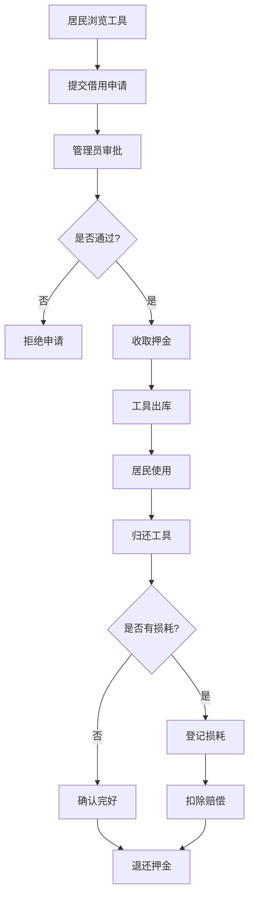

## 1. 产品概述

轻量小区工具借还站是面向邻里社区的共享工具管理平台，解决家庭偶发使用工具的借还需求，通过押金机制保障工具完好，通过损耗登记追溯责任。

- 目标用户：小区管理员（运营方）、小区居民（借用方）
- 核心价值：降低工具闲置率，简化借还流程，明确责任追溯

## 2. 核心功能

### 2.1 用户角色

| 角色 | 登录方式 | 核心权限 |
|------|----------|----------|
| 管理员 | 固定账号密码 | 工具增删改查、借还审核、押金结算、损耗登记 |
| 居民 | 无需登录（姓名+房号） | 浏览工具、提交借用申请、查看归还状态 |

### 2.2 功能模块

1. **工具管理**：工具列表、新增工具、编辑工具、删除工具、库存管理
2. **借还管理**：借用申请列表、审批借用、确认归还、借用历史
3. **押金管理**：押金收取记录、押金退还记录、押金状态追踪
4. **损耗管理**：损耗登记、损耗列表、关联借还记录

### 2.3 页面详情

| 页面名称 | 模块名称 | 功能描述 |
|----------|----------|----------|
| 仪表盘 | 数据概览 | 工具总数、借用中、押金余额、损耗次数统计卡片 |
| 工具管理 | 工具列表 | 卡片式展示工具，支持搜索筛选、增删改操作 |
| 工具管理 | 工具表单 | 名称、分类、图片、描述、押金金额、日租金、库存 |
| 借还管理 | 借用列表 | 展示所有借用记录，状态：待审批、借用中、已归还、已逾期 |
| 借还管理 | 新建借用 | 选择工具、填写借用人信息、预计归还时间 |
| 押金管理 | 押金列表 | 展示所有押金流水，关联借用记录 |
| 损耗管理 | 损耗列表 | 展示所有损耗登记，关联借用记录、工具、责任人 |
| 损耗管理 | 损耗登记表单 | 损耗描述、损坏程度、赔偿金额、关联借还记录 |

## 3. 核心流程

### 3.1 借用流程
居民浏览工具 → 提交借用申请（填写姓名、房号、联系方式、借用时长）→ 管理员审批 → 收取押金 → 工具出库 → 居民使用 → 归还工具 → 管理员确认完好 → 退还押金 → 流程结束

### 3.2 损耗处理流程
归还时发现损耗 → 管理员登记损耗信息 → 确定赔偿金额 → 从押金中扣除赔偿 → 退还剩余押金（或补交）→ 损耗归档

## 4. 用户界面设计

### 4.1 设计风格
- 主色：温暖的社区绿色 `#2E7D32`，代表邻里互助、自然环保
- 辅助色：琥珀橙 `#FF8F00`，用于提醒和操作按钮
- 中性色：石板灰系列，保证可读性
- 按钮风格：圆角 8px，微阴影，hover 上浮效果
- 字体：标题使用思源黑体（粗体），正文使用思源宋体
- 布局：左侧导航栏 + 右侧内容区，卡片式布局
- 图标风格：Lucide 线性图标，简洁统一

### 4.2 页面设计概览

| 页面名称 | 模块名称 | UI 元素 |
|----------|----------|----------|
| 仪表盘 | 数据概览 | 4 个统计卡片（绿色渐变背景）、快捷操作区、最近借还记录列表 |
| 工具管理 | 工具列表 | 搜索栏 + 分类筛选、网格卡片布局（工具图、名称、库存、押金、操作按钮） |
| 借还管理 | 借用列表 | 状态标签（待审批/借用中/已归还/已逾期）、表格展示、行内操作按钮 |
| 押金管理 | 押金列表 | 收入/支出金额高亮显示、关联借用记录跳转 |
| 损耗管理 | 损耗列表 | 损坏程度标签（轻微/一般/严重）、赔偿金额高亮、图片展示区 |

### 4.3 响应式
采用桌面端优先设计，宽度 < 768px 时导航折叠为汉堡菜单，卡片布局自适应为单列。
