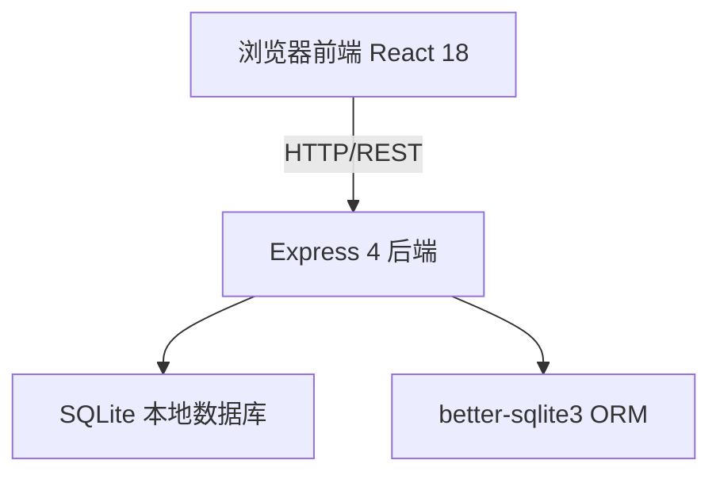
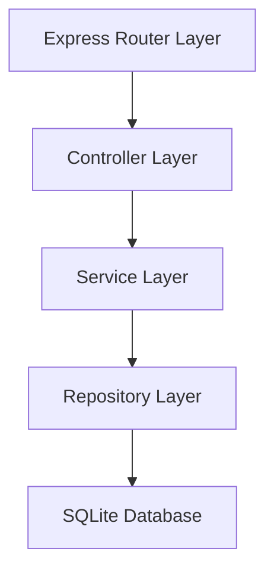
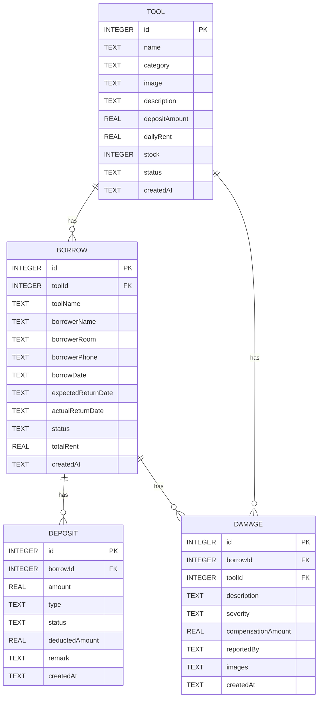

## 1. 架构设计



## 2. 技术说明

- 前端：React@18 + TypeScript + Vite + TailwindCSS@3 + Zustand + React Router + Lucide React
- 后端：Express@4 + TypeScript + better-sqlite3
- 数据库：SQLite（轻量本地文件数据库，无需额外服务）
- 初始化工具：vite-init（react-express-ts 模板）

## 3. 路由定义

| 前端路由 | 页面用途 |
|----------|----------|
| / | 仪表盘（数据概览） |
| /tools | 工具管理列表 |
| /tools/new | 新增工具 |
| /tools/:id/edit | 编辑工具 |
| /borrows | 借还记录列表 |
| /borrows/new | 新建借用申请 |
| /deposits | 押金管理列表 |
| /damages | 损耗登记列表 |
| /damages/new | 新增损耗登记 |

## 4. API 定义

### 4.1 工具 API

```typescript
// 工具类型定义
interface Tool {
  id: number;
  name: string;
  category: string;
  image: string;
  description: string;
  depositAmount: number;
  dailyRent: number;
  stock: number;
  status: 'available' | 'maintenance' | 'retired';
  createdAt: string;
}

// GET    /api/tools           获取工具列表（支持 category, keyword 查询）
// GET    /api/tools/:id       获取单个工具详情
// POST   /api/tools           新增工具
// PUT    /api/tools/:id       更新工具
// DELETE /api/tools/:id       删除工具
```

### 4.2 借还 API

```typescript
// 借用记录类型定义
interface Borrow {
  id: number;
  toolId: number;
  toolName: string;
  borrowerName: string;
  borrowerRoom: string;
  borrowerPhone: string;
  borrowDate: string;
  expectedReturnDate: string;
  actualReturnDate: string | null;
  status: 'pending' | 'approved' | 'rejected' | 'borrowing' | 'returned' | 'overdue';
  totalRent: number;
  createdAt: string;
}

// GET    /api/borrows         获取借用列表（支持 status 查询）
// GET    /api/borrows/:id     获取单个借用详情
// POST   /api/borrows         新建借用申请
// PUT    /api/borrows/:id     更新借用状态（审批、确认归还等）
```

### 4.3 押金 API

```typescript
// 押金记录类型定义
interface Deposit {
  id: number;
  borrowId: number;
  amount: number;
  type: 'collect' | 'refund';
  status: 'pending' | 'completed' | 'deducted';
  deductedAmount: number;
  remark: string;
  createdAt: string;
}

// GET    /api/deposits        获取押金列表
// POST   /api/deposits        新增押金记录
// PUT    /api/deposits/:id    更新押金状态（退还、扣款等）
```

### 4.4 损耗 API

```typescript
// 损耗记录类型定义
interface Damage {
  id: number;
  borrowId: number;
  toolId: number;
  description: string;
  severity: 'minor' | 'moderate' | 'severe';
  compensationAmount: number;
  reportedBy: string;
  images: string[];
  createdAt: string;
}

// GET    /api/damages         获取损耗列表
// GET    /api/damages/:id     获取单个损耗详情
// POST   /api/damages         新增损耗登记
```

## 5. 服务端架构图



## 6. 数据模型

### 6.1 ER 图



### 6.2 初始化数据

预置 8 个常用工具（电钻、梯子、扳手套装、手推车、打气筒、万用表、针线包、急救箱）和示例借还记录，便于演示。
